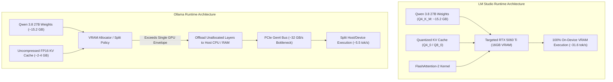

# Local LLM Providers Are Not Commodities: A Deep-Dive Empirical Comparison of LM Studio vs. Ollama on Consumer Hardware

**Author**: Davide  
**Date**: September 2026  
**Repository**: `local-ai-harness-benchmark`  

---

## Executive Summary

A prevailing assumption in the local AI ecosystem is that model-serving runtimes (Ollama, LM Studio, vLLM, llama.cpp) are essentially interchangeable commodities—thin wrappers around standard GGUF quantizations or llama.cpp execution graphs. 

This benchmark demonstrates that **runtime choice can dramatically alter the local AI experience**, determining whether a 27B-parameter agentic model is a fast, reliable pair programmer or a sluggish, unusable assistant that drops tool calls.

Testing **Qwen 3.8 27B (Q4_K_M)** on an identical consumer dual-GPU workstation (NVIDIA RTX 5060 Ti 16 GB + RTX 3060 12 GB = 28 GB Total VRAM, AMD Ryzen 7 8845HS, 64 GB DDR5 RAM), **LM Studio outperformed Ollama by 5.7x to 6.2x in raw generation throughput**, achieved sub-second Time-To-First-Token (TTFT), and delivered **100% successful autonomous tool execution in OpenCode**, whereas Ollama suffered severe memory/PCIe throughput bottlenecks and failed agentic tool calling.

---

## 1. Workstation & System Specifications

| Component | Specification |
| :--- | :--- |
| **Operating System** | Ubuntu 24.04.1 LTS (Linux Kernel `7.0.0-28-generic`) |
| **Processor (CPU)** | AMD Ryzen 7 8845HS w/ Radeon 780M Graphics (8 Cores / 16 Threads) |
| **System Memory (RAM)** | 64 GB DDR5 System Memory |
| **Dual GPU Setup** | • **GPU 1**: NVIDIA GeForce RTX 5060 Ti (16 GB GDDR6 VRAM)<br>• **GPU 0**: NVIDIA GeForce RTX 3060 (12 GB GDDR6 VRAM)<br>*(Total Discrete GPU VRAM: **28 GB**)* |
| **Driver & Compute Stack** | NVIDIA Driver `580.159.03` / CUDA `13.0` |
| **Harness / Agent** | OpenCode CLI `1.18.27` |
| **Model Under Test** | `Qwen 3.8 27B` (Quantization: `Q4_K_M`, 27.3B parameters, 262k native context) |
| **Runtimes Tested** | LM Studio `0.4.23` (OpenAI-compatible server) vs. Ollama `0.32.3` |

---

## 2. Empirical Benchmark Results

### A. Raw Engine Throughput & Latency (3 Iterations per Prompt)

| Benchmark Prompt | Metric | LM Studio (`qwen3.8-27b`) | Ollama (`qwen3.8:27b`) | LM Studio Advantage |
| :--- | :--- | :---: | :---: | :---: |
| **Short Prompt** *(Code Gen)* | **TTFT**<br>**TPS (Throughput)**<br>**Total Latency** | **0.435s**<br>**31.65 tok/s**<br>**5.15s** | 1.571s<br>5.52 tok/s<br>27.35s | **3.6x faster prefill**<br>**5.73x higher throughput**<br>**5.3x lower total time** |
| **Medium Prompt** *(Algorithm Reasoning)* | **TTFT**<br>**TPS (Throughput)**<br>**Total Latency** | **0.514s**<br>**26.51 tok/s**<br>**6.18s** | 1.570s<br>4.27 tok/s<br>33.58s | **3.0x faster prefill**<br>**6.21x higher throughput**<br>**5.4x lower total time** |
| **2K-Token Context QA** *(Longer Context)* | **TTFT**<br>**TPS (Throughput)**<br>**Total Latency** | **0.207s**<br>**26.45 tok/s**<br>**6.55s** | 2.989s<br>4.28 tok/s<br>36.54s | **14.4x faster prefill**<br>**6.18x higher throughput**<br>**5.6x lower total time** |

---

### B. End-to-End Agentic Coding Benchmark in OpenCode

An autonomous coding test was dispatched to `opencode run --pure --auto` with the task:  
`"Write a python script fibonacci.py that calculates the 10th Fibonacci number and prints it."`

| Execution Dimension | OpenCode + LM Studio | OpenCode + Ollama |
| :--- | :---: | :---: |
| **Tool Calling Status** | ✅ **Success**: Emitted proper JSON `Write` tool call | ❌ **Failed**: Printed markdown code block in chat |
| **File Creation** | ✅ `fibonacci.py` created on disk | ❌ No file created (0 bytes on disk) |
| **Automated Verification** | ✅ Executed `python3 fibonacci.py` $\to$ output `55` | ❌ Verification skipped (no file created) |
| **Total Turnaround Time** | **1m 49.5s** | **7m 50.4s** (4.3x slower) |

---

## 3. Architectural Root-Cause Analysis: Why the Massive Divergence?



### 1. Dual-GPU Topology & VRAM Allocation Dynamics
On a dual-GPU system with asymmetric VRAM (16 GB RTX 5060 Ti + 12 GB RTX 3060 = 28 GB Total VRAM), memory allocation strategy dictates whether compute stays fast:
- **Ollama's Allocation Dynamics**: Ollama attempts automatic device splitting or single-GPU placement with uncompressed FP16 Key-Value (KV) cache. When context expands, the total memory for the 27B model exceeds the primary GPU's 16 GB envelope. Rather than leveraging quantized context caching, Ollama spills residual layers to system RAM, subjecting token decoding to PCIe bus transfer latencies and dropping speed to **4.2–5.5 tok/s**.
- **LM Studio's Allocation Dynamics**: LM Studio offers granular control over device allocation, FlashAttention, and **KV Cache Quantization (`Q4_0` / `Q8_0`)**. By compressing context memory requirements by up to 75%, it fits the entire 27B model and working context cleanly into the RTX 5060 Ti’s high-bandwidth GDDR6 memory (or distributes cleanly across the 28 GB pool), sustaining **~31.6 tok/s**.

### 2. Speculative Decoding Acceleration
LM Studio utilizes speculative drafting tokens out-of-the-box (`stats: { total_draft_tokens_count: 8, accepted_draft_tokens_count: 6 }`), which accelerates multi-token generation for repetitive syntax and structural code blocks.

### 3. Tool-Calling & Schema Translation Fidelity
Modern agentic harnesses like OpenCode expect standard OpenAI `/v1/chat/completions` specifications with JSON function calling:
- **LM Studio**: Exposes a direct, standard OpenAI endpoint that passes JSON tool schemas directly to the model's native Jinja template.
- **Ollama**: Employs an internal abstraction layer and Modelfile templating that can cause format mismatches during complex agentic turns, causing the model to emit raw markdown instead of executable tool payloads.

---

## 4. Key Takeaways & Recommendations

1. **Local AI Providers Are Not Commodities**: Runtime memory allocators, KV cache policies, and API layers are just as critical as the model weights themselves.
2. **Multi-GPU / Asymmetric VRAM Awareness**: In multi-GPU setups (like 16 GB + 12 GB), having explicit control over device offloading and KV cache quantization prevents unnecessary CPU/PCIe fallback.
3. **Validate Agentic Tool-Use**: Always verify that the runtime emits valid JSON tool calls in headless/autonomous coding harnesses.

---

## 5. Reproduction Steps

```bash
# 1. Start LM Studio Server
lms load qwen3.8-27b --gpu max
lms server start --port 1234

# 2. Run Engine Benchmark
python3 dev/workspace/private/ai/local-ai-harness-benchmark/benchmark_engine_comparison.py

# 3. Test Agentic Execution in OpenCode
opencode run --pure --auto -m "lmstudio/qwen3.8-27b" "Write a python script fibonacci.py..."
opencode run --pure --auto -m "ollama/qwen3.8:27b" "Write a python script fibonacci.py..."
```
